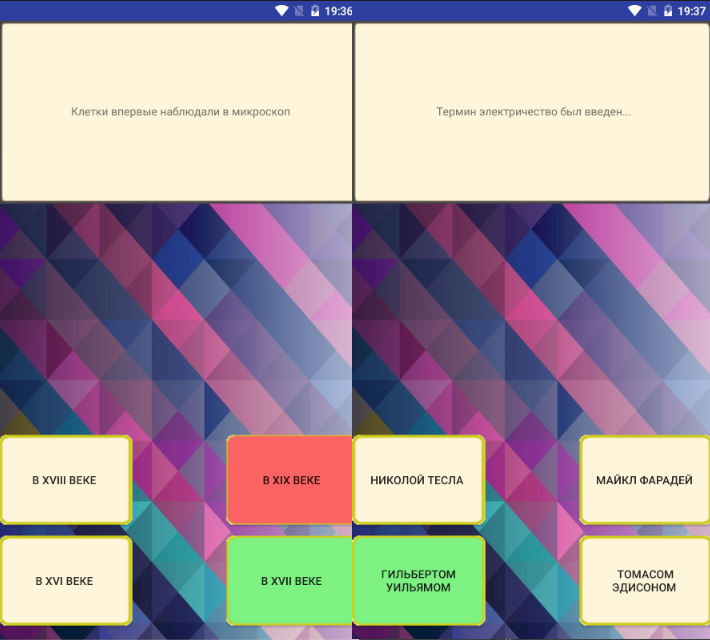

# Quiz

A simple quiz game application.



## Installation

Download .apk from releases and play.

## Gameplay

There are 2 gamemodes:

1. Endless game - you can keep playing until you make 3 mistakes.
2. Blitz - you have to answer 10 questions.

## Question modification

The questions are stored in ```res/values/arrays.xml``` in array "Questions".

The format is: 
Question\Answer1\Answer2\Answer3\Answer4\Right answer index.
